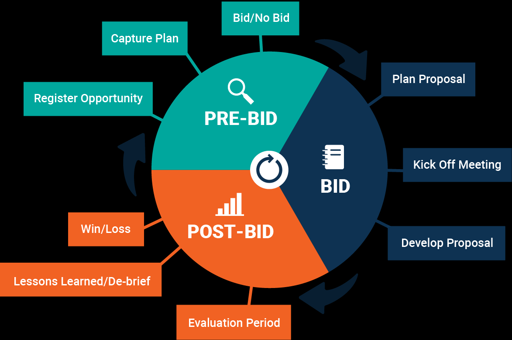

# Clausewitz

## Introduction

### Bid management

### Sales Process
#### Decisions
#### Stakeholder

## Functional requirements

### 360° view
#### Transparancy
#### Customer specific
#### Deal specific

### Guidance and Overview
A bid often requires many steps in a certain order and time frame.
Support and guideance for bid managers is necessary to provide structure and ease the workload.

#### Phases
The rough phases are
- Pre bid
- Bid
- Post bid

Each company may define more specific phases, e.g. a bid phase can consist of "Proposal" and "Negotiate" phase.

For each phase there are certain things to do and look out for.
It shall be possible to provide information and possible next steps depending on the phase of a project.

#### Milestones / Decisions

#### Documents
Documents need to be available and referenced to quickly navigate important documents of a project.
Additionally, templates also need to be readily available which can be filled in stored in a document storage.
Usually every phase has a different set of documents which need to be available.
Also they are required to be stored and available in different version for each milestone.

In general, there are documents which occure in every bid.
Then there are documents which might contain additional information but are customer specific.

Because a lot of documents contain information which can be automatically extracted and used to assist in the bid process, the documents need to be slightry structured.
It happens that there are multiple documents of the same category or a document is separated into multiple.

Attachement T: Tender
Attachement RFP: Request for Proposal

#### Activities
Every phase consist of certain activities which need to be carried out.
Activities shall be available in CRM system as well to pay tribute to 360° view on customer as well as of specific deals.
Of course some activities require different systems as well, e.g. meetings are usually planned via a dedicated application, e.g. Microsoft Outlook.
Still, the information needs to be carried over to CRM system as well.

### Tender / RFP / RFQ
When a customer releases a tender or sends a RFP it's the beginning of the critical path.
Customers have deadlines until a proposal has to be supplied.
On supplier side many things need to happen.

For projects the milestone Bid / No bid needs to happen.
After a successful Bid decision 

#### Elements on Tender / RFP / RFQ
The most important information of a tender / RFP needs to be extracted from the document to be as efficient as possible.
Such information could be on terms & conditions, requested scope and services, delivery times, etc.
Those information is valuable for a first estimation on how much effort, validation and clarification is required.

A summary should be extracted, grouped by following categories. The summary should contain relevant information in RFP on given group 
or if no specific information is included for a group in RFP it should state that as well.

#### Risk management
- Risk register

#### Stakeholder
Stakeholders are people who represents roles and functions in a company who are required to make a project or opportunity successfull.
Each have their specific stake they need to evaluate and provide feedback on.

##### Determination
Following steps are required to automatically determine stakeholders.
1. Upload Tender / RFP / RFQ document
2. Analyze document for required stakeholder
3. Suggest needed stakeholder groups
4. Allow other stakeholder groups from list of available groups to be selected as well

Afterwards, real persons need to be determined
1. Determine persons for each stakeholder group
2. Make stakeholders available for selection

Once required stakeholders were selected
1. Save selected stakeholders

After having the final list of stakeholders saved, they should be visible and available in the overview.
But nothing should be triggered in any system yet, e.g. automatic task creation for stakeholders in CRM system needs to be an additional step.
The status of those stakeholders should be "Draft".

Once every stakeholder was informed about their stake (e.g. via Offer Kickoff Meeting):
1. Allow to add / change each saved stakeholder
	a. Add / Change stakeholder person
	b. Add / Change due date
	c. Add / Change work package
2. Make it possible to either create objects in other systems for one stakeholder at a time or for all at once
3. After informing and including stakeholders the status of said stakeholder should be "Open"

Now each stakeholder is informed about their stake and should work on it.
Each stakeholder can set their object to "Done" or "Cancelled" including a feedback of their stake.

##### Overview / Status
There shall be an overview of all stakeholders showing their status and additional information.
Additionally, it should be highlighted once due dates were or are almost breached.

##### Escalation
A escalation routine shall be in place for stakeholders which are not compliang or are about to breach their due date.

### Date calculation
Being successful requires structure and planning ability.
A major aspects of being able to plan is orientate on milestones, deadlines or certain dates.
Based on these, it should be possible to calculate when other activities need to happen.

Most activities can be done in parallel, also the date calculation is usually backwards as most of the time deadlines are given by customers which need to be uphold.

#### Forward
A forward calculation is not fixated on a certain deadline when something needs to happen.
Instead, it uses a date when to start with activities.
Each activity adds their amount of needed time and puffer, resulting in a date in the future.

#### Backward
A backward calculation uses a date when something needs to happen at the latest possible time and calculates which activities need to happen when before.
E.g. the deadline for a RFP at customer side is on date t, other activities need to be finished at t - 5 days, t - 10 days, etc.
When knowing which activities need to happen, combined with the amount of time and puffer needed, this results in a backward calculation.

For backwards calculation the fixed date is the date of "Offer submission".
From this date all activities need to calculated when they need to happen.
Also relations of activities need to be considered, also most of activities are done in parallel.

There are some activities which are fixed, defined by process, others depend on the project (e.g. stakeholders).
Example of a backwards calculation of fixed and variable activities:

| Activitiy			| Date						| Duration + Puffer	|
|-------------------|---------------------------|-------------------|
| Offer deadline	| t	= fixed					|					|
| Offer submission	| s	= t - 1 day - 1 day		| 1 day + 1 day		|
| Offer approval	| a	= s - 5 day - 2 days	| 5 day	+ 2 days	|
| Board approval	| b = s - 1 day - 20 days	| 1 day + 20 days	|
| Activity #n		| a #n= b - 5 days - 2 days | 5 days + 2 days	|
| Activity #m		| a #m = b - 3days - 1 day	| 3 days + 1 day	|

## Technical requirements